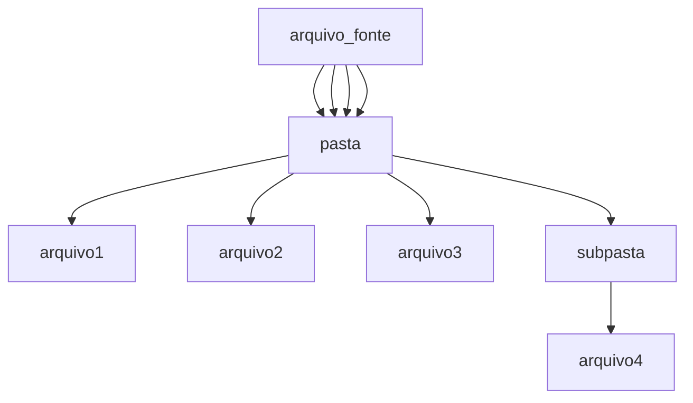

# Grepado

Um script que simplifica a utilização do comando grep. É possível utilizar um arquivo como fonte de pesquisa para a busca de valores em uma pasta definida pelo usuário.

> Todo script pode ser resumido em algumas linhas de scrpt bash, ou linhas de comando.

[](https://www.python.org/)
[]()
[]()


```
 + Autor: MrCl0wn
 + Blog: http://blog.mrcl0wn.com
 + GitHub: https://github.com/MrCl0wnLab
 + Twitter: https://twitter.com/MrCl0wnLab
 + Email: mrcl0wnlab\@\gmail.com
```

## FLOW


---

--help

```bash
╔──────────────────────────────────────────────────────────────────────────────────╗
│ ██████╗     ██████╗     ███████╗    ██████╗      █████╗     ██████╗      ██████╗ │
│██╔════╝     ██╔══██╗    ██╔════╝    ██╔══██╗    ██╔══██╗    ██╔══██╗    ██╔═══██╗│
│██║  ███╗    ██████╔╝    █████╗      ██████╔╝    ███████║    ██║  ██║    ██║   ██║│
│██║   ██║    ██╔══██╗    ██╔══╝      ██╔═══╝     ██╔══██║    ██║  ██║    ██║   ██║│
│╚██████╔╝    ██║  ██║    ███████╗    ██║         ██║  ██║    ██████╔╝    ╚██████╔╝│
│ ╚═════╝     ╚═╝  ╚═╝    ╚══════╝    ╚═╝         ╚═╝  ╚═╝    ╚═════╝      ╚═════╝ │
╚──────────────────────────────────────────────────────────────────────────────────╝
                                                                      By MrCl0wnLab
        
usage: Grepado [-h] -l file -r dir [-o file] [-s path] [-p cmd] [-u]

options:
  -h, --help            show this help message and exit
  -l file, --list file  Parâmetro arquivo com nome de valores para pesquisa (default: None)
  -r dir, --rc dir      Pasta onde será pesquisado os valores (default: None)
  -o file, --out file   Arquivo onde será salvo os valores (default: output-11-06-2024-03.txt)
  -s path, --skip path  Pasta que o processo vai pular. Ex: -k path ou --skip path2 ou -k {path1,path2,path3} (default: None)
  -p cmd, --pipe cmd    Comando que será executado depois de um pipe | (default: None)
  -u, --uq              Emite apenas a primeira linha de uma sequência repetida (default: False)
```

### EXEMPLO
```bash
main.py -l ./desaparecidos.txt -r ./governo/
main.py -l ./bins.txt -r ./telegram/ -o resultado.txt
main.py --list ./cpfs.txt --rc ./leak/ --out resultado.txt
main.py --list ./cpfs.txt --rc ./leak/ --out resultado.txt -s creditcard
main.py --list ./vermelho.txt --rc ./cores/ --out resultado.txt --skip {azul,laranja,verde}
main.py -l ./strings.txt -r ../arquivos/ --pipe "awk -F ':' '{print \$2}'"
main.py --list ./ids.txt -r ../sorteio/ -p "awk -F ':' '{print \$2}'"
main.py -l '../cpf.txt' -r ../sql/ -u
main.py -list ../desaparecidos.txt -r ../policia/ -u -p "awk -F ':' '{print \$2}' | sort -u" 
```

### GREP
Modelo comando grep usado
```bash
grep -i '{value}' -r {path} 
grep -i '{value}' -r {path} --exclude-dir={path}
grep -i '{value}' -r {path} --exclude-dir={path} | {pipe}
grep -i '{value}' -r {path} --exclude-dir={path} | sort -u | {pipe} 
```


### TERMINAL  OUTPUT


### ARQUIVO DE SAIDA
arquivo padrão
```
output-%d-%m-%Y-%H.txt
```