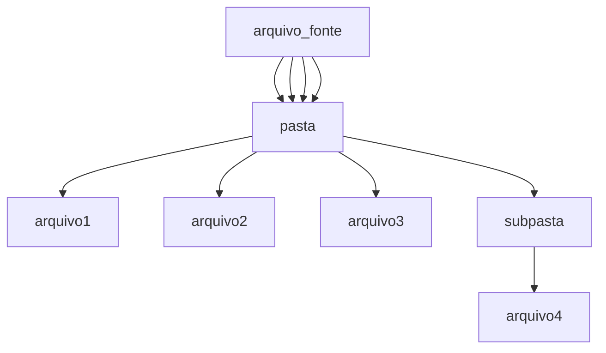

# Grepado

Um script que simplifica a utilização do comando grep. É possível utilizar um arquivo como fonte de pesquisa para a busca de valores em uma pasta definida pelo usuário.

> Todo script pode ser resumido em algumas linhas de scrpt bash, ou linhas de comando.

[](https://www.python.org/)
[]()
[]()


```
 + Autor: MrCl0wn
 + Blog: http://blog.mrcl0wn.com
 + GitHub: https://github.com/MrCl0wnLab
 + Twitter: https://twitter.com/MrCl0wnLab
 + Email: mrcl0wnlab\@\gmail.com
```

## FLOW


---

--help

```bash
╔──────────────────────────────────────────────────────────────────────────────────╗
│ ██████╗     ██████╗     ███████╗    ██████╗      █████╗     ██████╗      ██████╗ │
│██╔════╝     ██╔══██╗    ██╔════╝    ██╔══██╗    ██╔══██╗    ██╔══██╗    ██╔═══██╗│
│██║  ███╗    ██████╔╝    █████╗      ██████╔╝    ███████║    ██║  ██║    ██║   ██║│
│██║   ██║    ██╔══██╗    ██╔══╝      ██╔═══╝     ██╔══██║    ██║  ██║    ██║   ██║│
│╚██████╔╝    ██║  ██║    ███████╗    ██║         ██║  ██║    ██████╔╝    ╚██████╔╝│
│ ╚═════╝     ╚═╝  ╚═╝    ╚══════╝    ╚═╝         ╚═╝  ╚═╝    ╚═════╝      ╚═════╝ │
╚──────────────────────────────────────────────────────────────────────────────────╝
                                                                      By MrCl0wnLab
        
usage: Grepado [-h] -f file -p path [-s file] [-k path]

options:
  -h, --help            show this help message and exit
  -f file, --file file  Parâmetro arquivo com nome de valores para pesquisa (default: None)
  -p path, --path path  Pasta onde será pesquisado os valores (default: None)
  -s file, --save file  Arquivo onde será salvo os valores (default: output-%d-%m-%Y-%H.txt)
  -k path, --skip path  Pasta que o processo vai pular. Ex: -k path ou --skip path2 ou -k {path1,path2,path3} (default: None)
```

### EXEMPLO
```bash
python main.py -f ./desaparecidos.txt -p ./governo/
python main.py -f ./bins.txt -p ./telegram/ -s resultado.txt
python main.py --file ./cpfs.txt --path ./leak/ --save resultado.txt
python main.py --file ./cpfs.txt --path ./leak/ --save resultado.txt --skip creditcard
python main.py --file ./vermelho.txt --path ./cores/ --save resultado.txt --skip {azul,laranja,verde}
```

### GREP
Comando grep usado
```bash
grep -i '{value}' -r {path} 
grep -i '{value}' -r {path} --exclude-dir={path}
```


### TERMINAL  OUTPUT


### ARQUIVO DE SAIDA
arquivo padrão
```
output-%d-%m-%Y-%H.txt
```